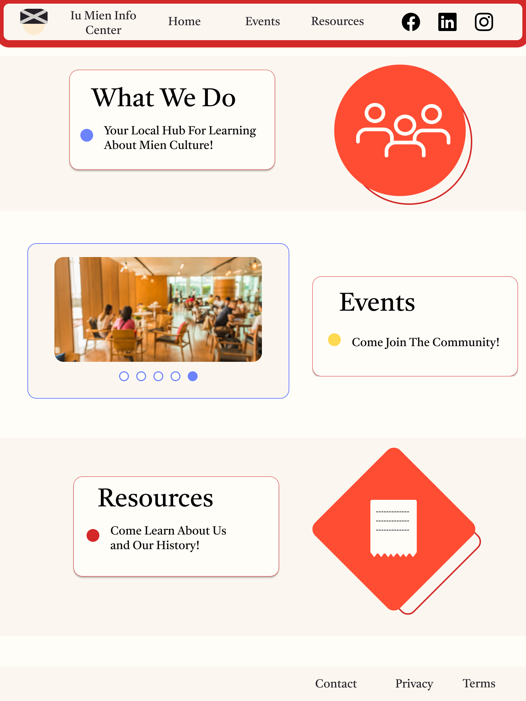
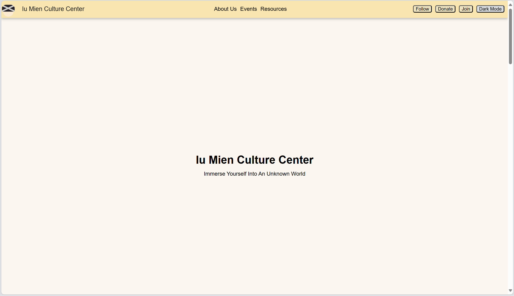

# Iu Mien Culture Center

Simple outreach page design to share and preserve Iu Mien culture. Built with plain HTML, CSS, and a JavaScript. Designed in Figma and created for CodePath's Web Development 101's advocacy project in Fall 2024.

#### Initial design

#### Live site preview

Features:
- A small, accessible webpage documenting Iu Mien culture.
- Sections for About, Events, and Resources.
- A membership/signature form that shows a thank-you modal when someone signs.
- Darkmode